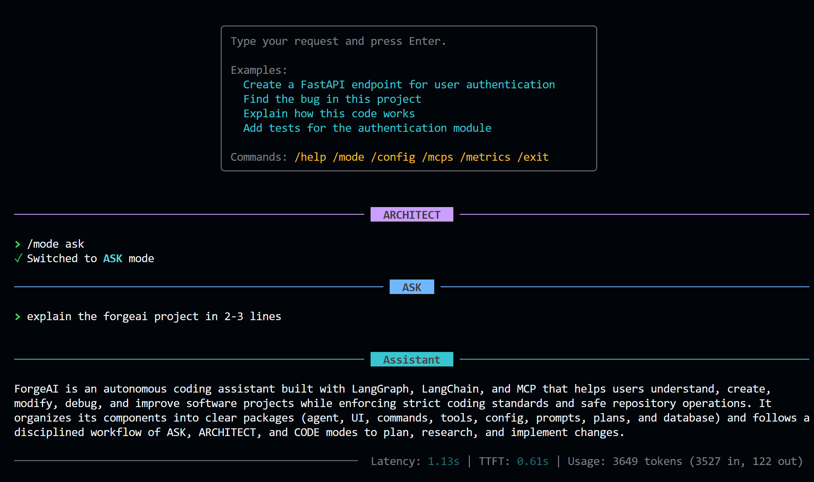

# ⚡ ForgeAI

### Autonomous AI Coding Agent powered by LangGraph & MCP

ForgeAI is a CLI-based AI coding agent that can **understand tasks, plan changes, use tools, modify code, and execute commands** with persistent context.

It is built for developers who want an AI agent that can work directly inside a project.

---

## 📸 ForgeAI in Action

<p align="center">
  
</p>

---

## ✨ Features

- 🤖 **Autonomous Coding** — Understands and executes coding tasks
- 🧠 **LangGraph Agent** — Stateful multi-step agent workflow
- 🔌 **MCP Support** — Connect external tools dynamically
- 💾 **Persistent Memory** — SQLite-based conversation checkpoints
- 🛡️ **Human-in-the-Loop** — Approve important tool actions
- 🎯 **Multiple Modes** — `CODE`, `ARCHITECT`, `ASK`
- 📊 **Metrics** — Track tokens, latency and usage
- ⚡ **Streaming CLI** — Real-time AI responses

---

## 🏗️ Architecture

```text
                 ┌──────────────┐
                 │   ForgeAI    │
                 │     CLI      │
                 └──────┬───────┘
                        │
                        ▼
                ┌───────────────┐
                │   LangGraph   │
                │     Agent     │
                └───────┬───────┘
                        │
          ┌─────────────┼─────────────┐
          ▼             ▼             ▼
      File Tools    Shell Tools    MCP Tools
          │             │             │
          └─────────────┼─────────────┘
                        ▼
                 Project / System
```

---

## 🎯 Modes

| Mode        | Purpose                          |
| ----------- | -------------------------------- |
| `CODE`      | Write, modify and execute code   |
| `ARCHITECT` | Plan and design changes          |
| `ASK`       | Read-only questions and research |

---

## 🛠️ Tech Stack

- **Python**
- **LangChain**
- **LangGraph**
- **MCP**
- **OpenAI**
- **SQLite**
- **Rich CLI**
- **Pydantic**

---

## 🚀 Quick Start

### 1. Clone

```bash
git clone https://github.com/DevDilip28/forgeai
```

### 2. Create environment

```bash
python -m venv .venv
```

Windows:

```bash
.venv\Scripts\activate
```

Linux/macOS:

```bash
source .venv/bin/activate
```

### 3. Install

```bash
pip install -e .
```

### 4. Configure

Create `.env`:

```env
OPENAI_API_KEY=your_api_key
MODEL_NAME=gpt-4o
```

### 5. Run

```bash
forgeai chat
```

---

## 💬 Example

```text
$ forgeai chat

> Build a FastAPI authentication system

ForgeAI:
Planning task...

✓ Created architecture plan
✓ Created authentication routes
✓ Added database models
✓ Added JWT authentication
✓ Running tests...

Done.
```

---

## 📁 Project Structure

```text
forgeai/
├── .forgeai/
│   ├── db/
│   ├── plans/
│   ├── prompts/
│   └── rules/
│
├── forgeai/
│   ├── agent/
│   ├── commands/
│   ├── config/
│   ├── tools/
│   ├── ui/
│   └── main.py
│
├── .env.example
├── pyproject.toml
└── README.md
```

---

## 🔐 Safety

ForgeAI includes:

- Human approval for tool execution
- Mode-based permissions
- Dangerous command protection
- Restricted planning directory
- Gitignore-aware file operations

---

### Built with ⚡ LangGraph + MCP

**ForgeAI — AI that can actually work on your codebase.**
